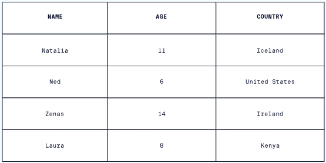

# SQL 

### What is a DataBase ?

In computing, a database is an organized collection of data or a type of data store based on the use of a database management system (DBMS), the software that interacts with end users, applications, and the database itself to capture and analyze the data. The DBMS additionally encompasses the core facilities provided to administer the database. The sum total of the database, the DBMS and the associated applications can be referred to as a database system. Often the term "database" is also used loosely to refer to any of the DBMS, the database system or an application associated with the database.

Small databases can be stored on a file system, while large databases are hosted on computer clusters or cloud storage. The design of databases spans formal techniques and practical considerations, including data modeling, efficient data representation and storage, query languages, security and privacy of sensitive data, and distributed computing issues, including supporting concurrent access and fault tolerance.


### What is 'SQL' ?

[Youtube Link : What is SQL And Relational Database ](https://youtu.be/MZdO1UbTG4U)

A database is a set of data stored in a computer. This data is usually structured in a way that makes the data easily accessible.
A relational database is a type of database. It uses a structure that allows us to identify and access data in relation to another piece of data in the database. Often, data in a relational database is organized into tables.


# 'SQL' langage

### Tables 

Tables can have hundreds, thousands, sometimes even millions of rows of data. These rows are often called records.

Tables can also have many columns of data. Columns are labeled with a descriptive name and have a specific data type.

For example, a column called age may have a type of INTEGER.




n the table above, there are three columns (name, age, and country).

The name and country columns store string data types, whereas age stores integer data types. The set of columns and data types make up the schema of this table.

### Rows and Columns

Items in row are aligned from left to right, while columns are aligned from top to bottom. A row is a horizontal alignment of data, while a column is vertical. Data in a row contains information that describes a single entity, while data in a column describes a field of information all entities possess.

You need to store your matrix in table specifying the columns and rows like this
```
CREATE TABLE nom_de_la_table
(
    colonne1 type_donnees,
    colonne2 type_donnees,
    colonne3 type_donnees,
    colonne4 type_donnees
);
```
You insert your data:
```
CREATE TABLE utilisateur
(
    id INT PRIMARY KEY NOT NULL,
    nom VARCHAR(100),
    prenom VARCHAR(100),
    email VARCHAR(255),
    date_naissance DATE,
    pays VARCHAR(255),
    ville VARCHAR(255),
    code_postal VARCHAR(5),
    nombre_achat INT
)
```
You can simply find what you need using two queries
```
select column, row from utilisateur where value = 'nom VARCHAR(100)';
select value from utilisateur where column = 2 and row = 3;
```

### Primary and Foreign key

The PRIMARY KEY constraint uniquely identifies each record in a table. Primary keys must contain UNIQUE values, and cannot contain NULL values. A table can have only ONE primary key; and in the table, this primary key can consist of single or multiple columns (fields).

- A primary key is defined within a single table and uniquely identifies each record in that table.
- Its purpose is to ensure data integrity, enforce uniqueness, and provide a reliable means of identifying individual records.
- The primary key value cannot be null or duplicated within the table.
- Primary keys are often used to establish relationships with other tables through foreign keys.


The FOREIGN KEY  is a field (or collection of fields) in one table, that refers to the PRIMARY KEY in another table. The table with the foreign key is called the child table, and the table with the primary key is called the referenced or parent table.

- The foreign key is used to establish relationships between tables.
- It refers to a connection or relationship between two tables that ensures data consistency and accuracy.
- Foreign keys maintain referential integrity by ensuring that the values in the - foreign key field correspond to valid primary key values in the referenced table.

### SQL queries 

Using a query makes it easier to view, add, delete, or change data in your Access database. Some other reasons for using queries:

- Find specific quickly data by filtering on specific criteria (conditions)

- Calculate or summarize data

- Automate data management tasks, such as reviewing the most current data on a recurring basis.

In a well-designed database, the data that you want to present through a form or report is usually located in multiple tables. A query can pull the information from various tables and assemble it for display in the form or report. A query can either be a request for data results from your database or for action on the data, or for both. A query can give you an answer to a simple question, perform calculations, combine data from different tables, add, change, or delete data from a database. Since queries are so versatile, there are many types of queries and you would create a type of query based on the task.

### SQL index 

Indexes are special lookup tables that need to be used by the database search engine to speed up data retrieval. An index is simply a reference to data in a table. A database index is similar to the index in the back of a journal.

For example, in order to reference all pages in a book that address a particular subject, you go to the index first, which lists all the topics alphabetically, and then you go to one or more specific page numbers.
Two primary methods to use the index in SQL are:
```
    CREATE INDEX Command 
    DROP INDEX Command 
```
```
    CREATE INDEX name_of_Index ON name_Of_Table(Attribute1, Attribute2,...);`
```

### SQL Joins

SQL Server performs sort, intersect, union, and difference operations using in-memory sorting and hash join technology. Using this type of query plan, SQL Server supports vertical table partitioning.

SQL Server implements logical join operations, as determined by Transact-SQL syntax:

- Inner join
- Left outer join
- Right outer join
- Full outer join
- Cross join

SQL Server employs four types of physical join operations to carry out the logical join operations:

- Nested Loops joins
- Merge joins
- Hash joins
- Adaptive joins 

[To learn more About SQL Joins, click on this link](https://learn.microsoft.com/en-us/sql/relational-databases/performance/joins?view=sql-server-ver16)